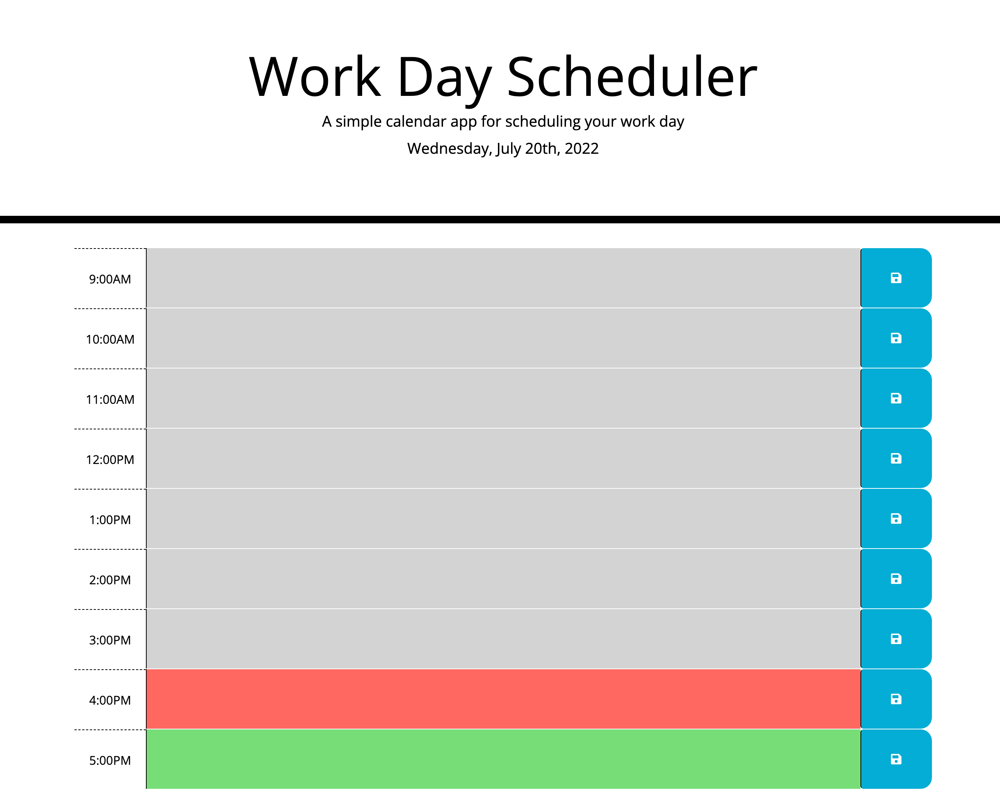

# special-scheduler

I used the starter code and added Bootstrap classes plus time blocks to create a work day scheduler. The current day and time is shown at the top of the page. The scheduler includes color-coded business hour timeblocks to indicate whether it is in the past, present, or future. Text can be entered and saved in these time blocks.

## Submission
GitHub Repo URL: https://github.com/hasnafar/special-dailyschedule
Deployed URL: https://hasnafar.github.io/special-dailyschedule/

 
